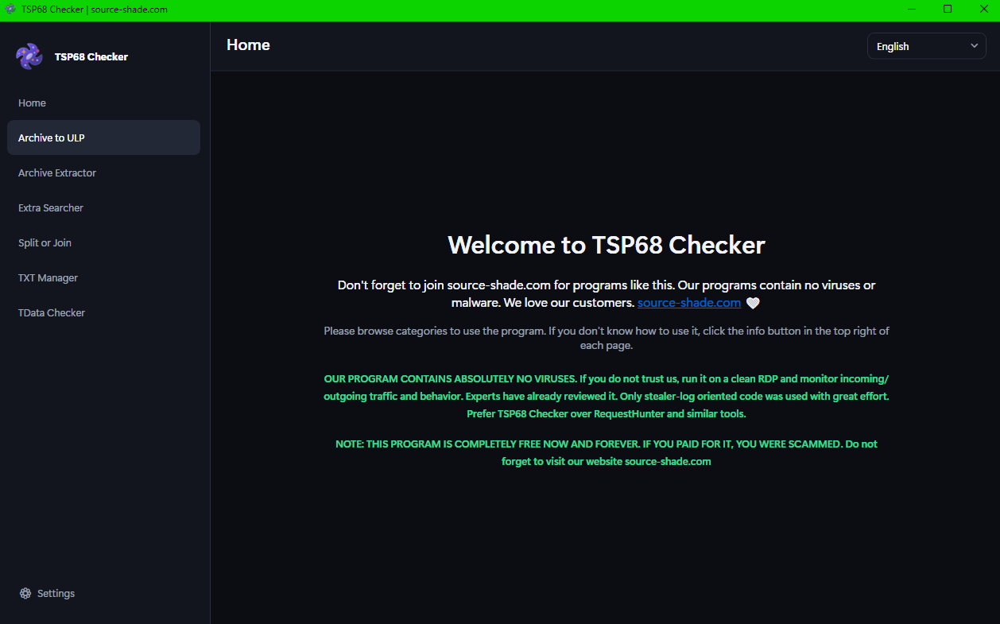
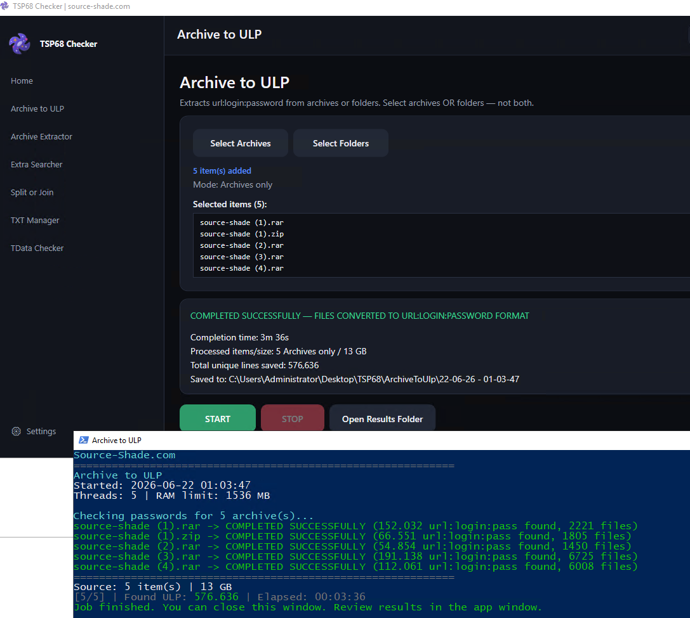
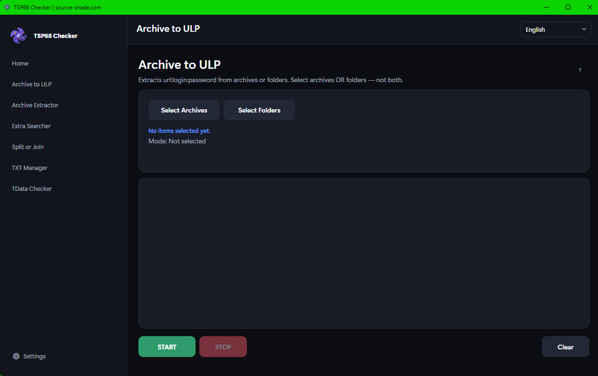
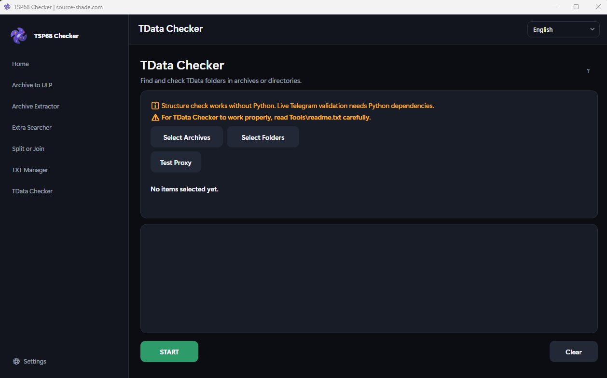

# TSP68 Checker v1.08

Windows tool for working with stealer logs. Unpack archives, pull credentials, search for cards/TData/wallets, check Telegram sessions.

Official site: [source-shade.com](https://source-shade.com)

**Download:** [Releases](https://github.com/tsp68/tsp68-checker/releases) → get `TSP68-v1.08.zip`, extract, run `TSP68Checker.exe`

Windows 10/11, 64-bit. No install needed.

---

## Screenshots

---

## Modules

- Archive to url:login:password
- Archive extractor
- Extra Searcher (credit cards, TDATA, wallets, bruteforce.txt)
- Split or Join
- TXT Manager
- TData Checker

---

### Archive to url:login:password

Takes password logs from stealer archives (or already extracted folders) and converts them into clean `url:login:password` lines.

The tool goes through nested archives, finds common password files like `passwords.txt` and `All Passwords.txt`, reads different field names (URL, HOST, LOGIN, EMAIL, PASS, etc.), removes duplicates, and saves everything to `ulp.txt`.

We ran a real comparison on a ~50 GB batch against RequestHunter. RequestHunter returned **1,546,049** lines. TSP68 Checker returned **5,981,105** lines. Same data, very different result.

Supports ZIP, RAR (including multi-part `.part01.rar`), 7z, TAR, GZ and more. Add your archive passwords in Settings before you start.

---

### Archive extractor

Unpacks archives into separate folders. Uses the password list from Settings, runs multi-threaded, and writes failed archives to `errorarchives.txt` so you can see what broke and why.

---

### Extra Searcher

Pick what you want to search for, then point it at archives or folders:

- **Credit cards** — finds and formats card data from known log file names
- **TDATA** — copies Telegram `tdata` folders into numbered output folders
- **Wallets** — pulls `wallets` folders from typical stealer layouts
- **bruteforce.txt** — collects bruteforce password files that sit next to wallet data

Turn on only the modules you need and run one job.

---

### Split or Join

Basic TXT utilities. Split a large file by size (MB), line count, or number of parts. Or merge several TXT files into one.

---

### TXT Manager

Load one or more TXT files, type search terms (one per line — a word, domain, phone number, whatever), and pull out every matching line. Good for hunting specific targets inside huge dumps. Results go to `Desktop\TSP68\TXTManager`.

---

### TData Checker

Finds `tdata` folders inside archives or on disk and checks whether they are usable.

**Without Python:** structure check only. Fast, no extra setup.

**With Python 3.11** (see `Tools\readme.txt`): full live Telegram check — phone, premium status, 2FA, dialog count, and more.

In Settings you can set up a Telegram bot (bot token + chat/group ID) to automatically zip and send live-valid TData sessions to your channel. Proxy support is there too (HTTP, SOCKS4, SOCKS5) with a test button on the TData page.

---

## Quick start

1. Download the zip from [Releases](https://github.com/tsp68/tsp68-checker/releases)
2. Extract anywhere
3. Run `TSP68Checker.exe`, pick a language
4. Open **Settings** (bottom left) → add archive passwords if your files are encrypted
5. Choose a module from the sidebar → select files → **START**
6. Output lands in `Desktop\TSP68` unless you changed the path in Settings

---

## Is this safe?

This program does **not** contain viruses or malware. That is stated on the home screen inside the app itself.

If you are unsure, run it on a clean RDP or VM, watch incoming/outgoing traffic, and check what it does. Security-minded people have reviewed it. The codebase is built specifically for stealer-log workflows.

**Do not use tools like RequestHunter.** They are known to ship infected builds. TSP68 Checker was made as a cleaner, faster alternative.

This software is **free**. Now and always. If someone charged you money for it, you were scammed. Official builds live here and on [source-shade.com](https://source-shade.com).

---

## Other notes

- 6 languages: English, Turkish, Russian, German, Arabic, Indonesian
- Multi-threaded processing, works on weaker PCs
- Long jobs open a console window so the GUI does not freeze
- For live TData checks: install Python 3.11 and follow `Tools\readme.txt`

Use only on data you are allowed to process.

---

Maintained by [source-shade.com](https://source-shade.com)
